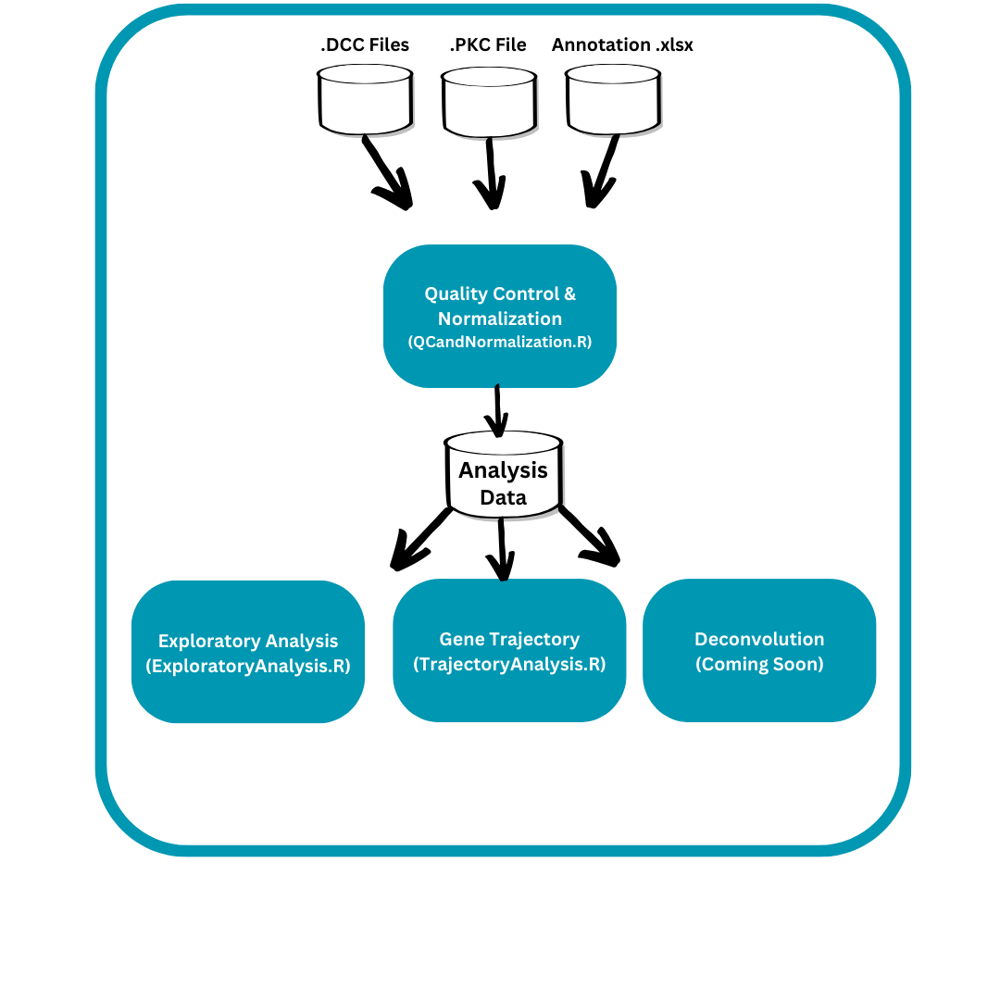

# Introduction
The purpose of this pipeline is to process and analyze data from the Nanosting GeoMx Spatial Profiler. This pipeline starts from the raw count files (.dcc), gene annotation files (.pkc), and the sample annotation Excel file and works through quality control, normalization, and exploratory analysis. Additional steps to this pipeline (such as deconvolution) are currently in the works and will be incorporated into this workflow. Each step in this pipeline is contained in its own R file, making each step in this pipeline independent from the other steps. The natural workflow for this pipeline is outlined in the diagram below.   

We have provided a vignette that walks you through these analysis steps and includes detailed information about applying this pipeline to new data. 
